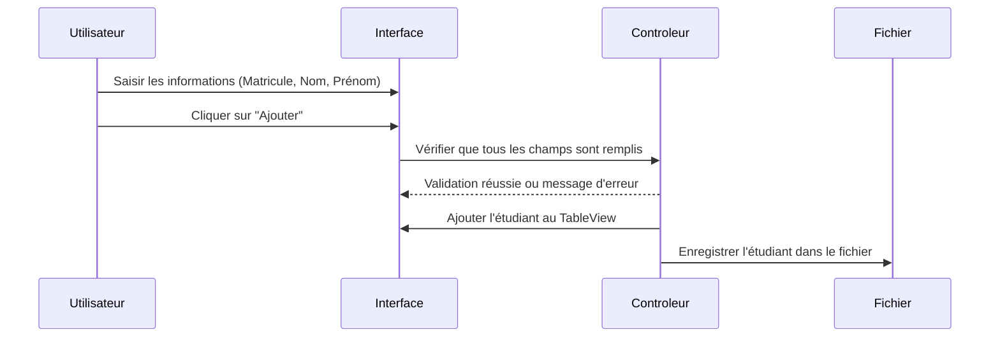
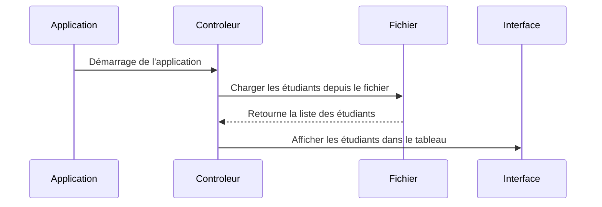
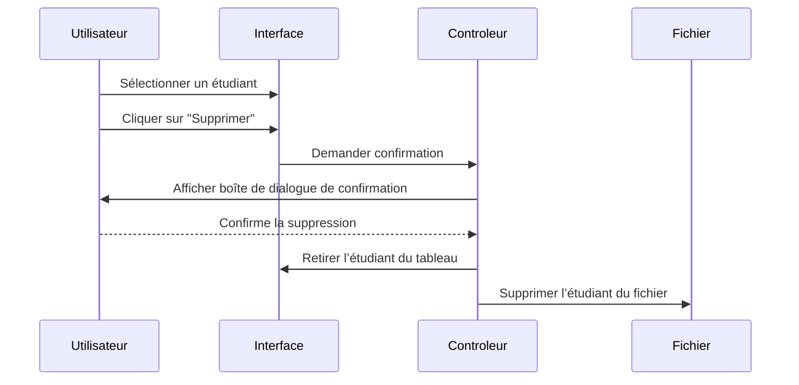
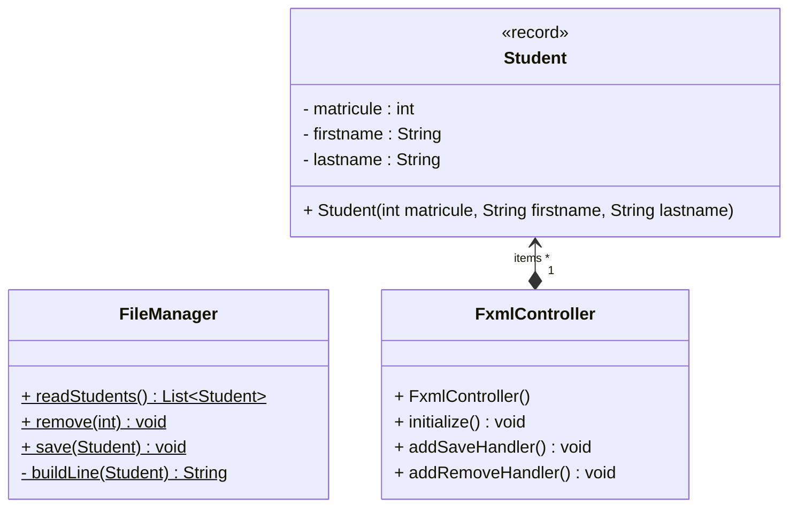

# Exercice 03 - Les TableView

Dans cet exercice vous allez réaliser votre première application
complète utilisant un fichier FXML. Cette application utilise
le composant `TableView` dont vous trouverez une brève
description ci-dessous.

## Composant plus évolué : TableView

Un `TableView` est un composant JavaFX permettant d'afficher et de 
manipuler des données sous forme de tableau. 
Il est particulièrement utile pour afficher des listes d'objets sous 
forme de colonnes, avec la possibilité d'ajouter des fonctionnalités 
comme le tri, la sélection et l'édition des cellules.
Pour instancier un `TableView<T>` il faut spécifier le type des objets à afficher.
Par exemple pour afficher un tableau contenant des instances de `Person` : 

```java
TableView<Person> tableView = new TableView<>();
```

## Définir une colonne via TableColumn

Chaque colonne du tableau est représentée par une instance de `TableColumn<S, T>`, où :

- `S` est le type des objets contenus dans le `TableView`.
- `T` est le type de la donnée affichée dans la colonne.

Si la classe `Person` possède des attributs représentant le nom et l'âge de la personne,
on peut définir les colonnes via :

```java showLineNumbers
TableColumn<Person, String> nameColumn = new TableColumn<>("Nom");
nameColumn.setCellValueFactory(new PropertyValueFactory<>("name"));

TableColumn<Person, Integer> ageColumn = new TableColumn<>("Âge");
ageColumn.setCellValueFactory(new PropertyValueFactory<>("age"));

tableView.getColumns().addAll(nameColumn, ageColumn);
```

:::warning Convention de nommage

La classe `Person` doit implémenter les accesseurs `getName()` et
`getAge()`. Des accesseurs avec des noms différents empêchent le
fonctionnement de `PropertyValueFactory`.

:::

## ObservableList

Une `ObservableList<T>` est une liste spéciale fournie par JavaFX qui 
permet de suivre les modifications des éléments qu’elle contient. 
Contrairement à une simple `ArrayList`, elle notifie automatiquement les 
composants graphiques comme un `TableView` lorsque des éléments sont 
ajoutés, supprimés ou modifiés.
Elle est particulièrement utile pour lier des données dynamiques à une 
interface utilisateur sans avoir à gérer manuellement les mises à jour 
d'affichage.
On utilise la méthode `FXCollections.observableArrayList()` pour créer 
une `ObservableList` :

```java 
ObservableList<Person> data = FXCollections.observableArrayList(
    new Person("Alice", 25),
    new Person("Bob", 30)
);

tableView.setItems(data);
```

## Application de gestion des étudiants

Créez une application qui répond à l'analyse ci-dessous.

### Description des besoins

Développer une interface permettant d'ajouter des étudiants à un tableau après saisie de 
leurs informations dans des champs dédiés. Les données des étudiants doivent être enregistrées dans un fichier pour assurer leur persistance.
L'interface comprendra un tableau avec trois colonnes : Matricule, Nom et Prénom.
Au démarrage de l'application, les étudiants seront chargés depuis le fichier.
L'application devra inclure une gestion des erreurs, notamment en empêchant l'ajout 
d'un étudiant si un champ est vide.
Enfin, elle devra permettre la suppression d'un étudiant existant.

### Flux principal d'utilisation

Afin d'éclaircir la description des besoins, vous trouverez ci-dessous
une description des étapes qu'un utilisateur suit lors de l'utilisation de 
l'application.

:::info Ajout d’un étudiant

- Étape 1 : L’utilisateur saisit le Matricule, le Nom et le Prénom dans les champs de saisie.
- Étape 2 : L’utilisateur clique sur le bouton "Ajouter".
- Étape 3 : L’application vérifie que tous les champs sont remplis.
	- Si un champ est vide, un message d’erreur s’affiche et l’étudiant n’est pas ajouté.
- Étape 4 : L’étudiant est ajouté au tableau.
- Étape 5 : Les données sont enregistrées dans le fichier pour assurer leur persistance

:::

:::info Chargement des étudiants au démarrage

- Étape 1 : Au lancement de l’application, le programme lit les données du fichier.
- Étape 2 : Les étudiants enregistrés sont affichés dans le tableau.
- Étape 3 : Si le fichier est vide ou inexistant, aucun étudiant n’est affiché.

:::

:::info Suppression d’un étudiant

- Étape 1 : L’utilisateur sélectionne un étudiant dans le tableau.
- Étape 2 : Il clique sur le bouton "Supprimer".
- Étape 3 : Une confirmation est demandée.
- Étape 4 : Si l’utilisateur confirme, l’étudiant est retiré du tableau et du fichier

:::


### Diagrammes de séquences

Pour expliciter les cas d'utilisations à implémenter,
vous trouverez ci-dessous les diagrammes de séquences associés.

#### Ajout d’un étudiant



#### Chargement des étudiants au démarrage



#### Suppression d’un étudiant



### Diagramme de classes

La décomposition en classes suivante est proposée pour
répondre aux besoins de l'utilisateur.



### Plan de tests fonctionnels

Vérifiez manuellement que toutes les fonctionnalités de l'application respectent les besoins de l'utilisateurs en suivant le plan de tests proposés.  

:::note Format simplifié

Vous remarquerez que le nombre de cas de tests augmentant,
une présentation plus succincte du plan est proposée.

:::

| ID  | Test                        | Données d’entrée | Résultat attendu                               |
|-----|-----------------------------|-----------------|----------------------------------------------|
| T1  | Démarrage initial           | Aucune          | L'application s'ouvre avec un `TableView` vide |
| T2  | Chargement des étudiants     | Fichier contenant des étudiants | Les étudiants sont affichés dans le `TableView` |
| T3  | Ajout d’un étudiant valide  | Matricule: 123, Nom: "Dupont", Prénom: "Jean" | L'étudiant est ajouté au `TableView` et au fichier |
| T4  | Ajout avec un champ vide    | Matricule: "", Nom: "Durand", Prénom: "Paul" | Message d’erreur et ajout refusé                     |
| T5  | Ajout d’un étudiant existant | Matricule: 123 (déjà existant)   | Ajout accepté ou message d’erreur (selon règles)       |
| T6  | Suppression d’un étudiant   | Sélection d'un étudiant dans le `TableView`, clic sur "Supprimer" | L'étudiant est retiré du `TableView` et du fichier |
| T7  | Suppression sans sélection  | Aucun étudiant sélectionné, clic sur "Supprimer" | Message d'erreur, suppression refusée       |
| T8 | Fermeture et relance de l’application | Étudiants enregistrés | Après relance, les étudiants sont toujours affichés |
| T9 | Sauvegarde correcte    | Ajout d’un étudiant, fermeture, relance | L’étudiant ajouté est toujours présent après redémarrage |
| T10 | Manipulation simultanée | Ajouter puis supprimer immédiatement un étudiant | Pas de plantage, les actions fonctionnent correctement |
| T11 | Fichier corrompu      | Modifier manuellement le fichier des étudiants | Message d’erreur géré proprement |
