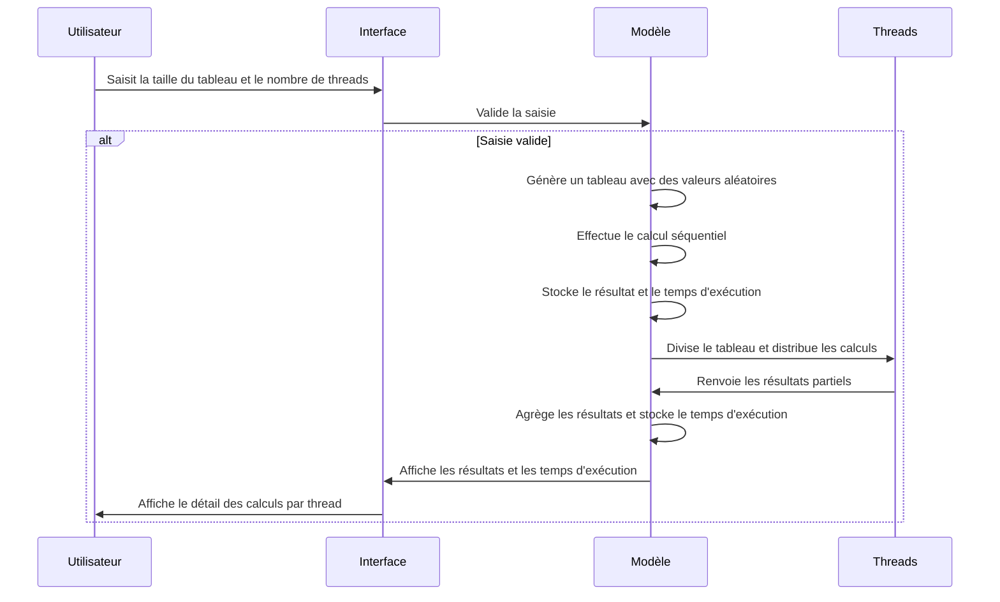
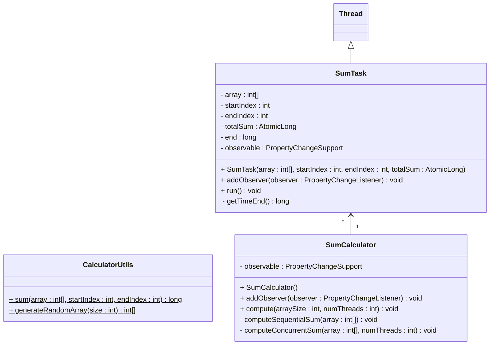

# Exercice 7 - Applications

L’objectif de cet exercice est d’implémenter un programme 
permettant de calculer la somme des éléments d’un tableau 
d’entiers en comparant deux méthodes :

- Un calcul séquentiel avec une seule boucle.
- Un calcul concourant réparti sur plusieurs threads.

Les éléments de ce tableaux sont des entiers générés aléatoirement entre 0 et 100.

L’interface graphique, réalisée à l'aide d'un fichier FXML, permettra à l’utilisateur de définir 
la taille du tableau et le nombre de threads à utiliser. 
À l’issue du calcul, les résultats des deux méthodes seront 
affichés avec les temps d’exécution respectifs.

## Flux principal d'utilisation

Afin d'éclaircir la description des besoins, vous trouverez ci-dessous
une description des étapes qu'un utilisateur suit lors de l'utilisation de 
l'application.

:::info Lancement d'un calcul

- Étape 1 : L’utilisateur saisit :
    - la taille du tableau d’entiers.
    - le nombre de threads à utiliser pour l’exécution concourante.
- Étape 2 : L’utilisateur clique sur le bouton "Démarrer le calcul".
    - Si la saisie est invalide (valeur non numérique, négative, vide ou excessive) un message d’erreur affiché et retour à l’Étape 1.
    - Si la saisie est valide le bouton est désactivé le temps du calcul.
- Étape 3 : Un tableau de la taille définie est généré avec des valeurs aléatoires entre 0 et 100.
	- Si une erreur survient (mémoire insuffisante, taille trop grande) un message d’erreur est affiché et retour à l’Étape 1.
- Étape 5 : Calcul séquentiel
    - Parcours du tableau avec une seule boucle pour calculer la somme.
    - Stockage du résultat et du temps d’exécution.
- Étape 6 : Calcul concourant : 
    - Division du tableau en plusieurs sous-parties selon le nombre de threads.
    - Chaque thread calcule la somme de sa portion.
    - Les résultats partiels sont additionnés.
    - Stockage des résultats et du temps d’exécution.
- Étape 7 : Affichage des résultats
    - Affichage des sommes obtenues par les deux méthodes.
    - Comparaison des temps d’exécution (séquentiel vs parallèle).
    - Affichage du détail des temps de calcul par thread.
    - Le bouton est réactivé.

:::

### Diagrammes de séquences

Pour expliciter le cas d'utilisation à implémenter,
vous trouverez ci-dessous les diagrammes de séquences associés.

### Diagramme de classes

La décomposition en classes suivante est proposée pour
répondre aux besoins de l'utilisateur. Seul la partie modèle, au sens MVC, du logiciel est proposée.

### Plan de tests fonctionnels

Vérifiez manuellement que toutes les fonctionnalités de l'application respectent les besoins de l'utilisateurs en suivant le plan de tests proposés.  

| ID   | Test                          | Données d’entrée | Résultat attendu                           |
|------|--------------------------------|-----------------|--------------------------------------------|
| T1 | Saisie correcte | Taille = 10 000, Threads = 4 | Lancement du calcul |
| T2 | Valeur négative | Taille = -100 | Message d'erreur |
| T3 | Nombre trop grand | Taille = 215 000 000 | Message d'erreur |
| T4 | Saisie non numérique | Taille = "abc" | Message d'erreur et retour à la saisie |
| T5 | Threads > Taille tableau | Taille = 100, Threads = 200 | Message d'avertissement |
| T6 | Calcul séquentiel | Taille = 10 000 | Somme correcte affichée avec temps d'exécution |
| T7 | Calcul parallèle (2 threads) | Taille = 10 000, Threads = 2 | Résultat correct, affichage des temps |
| T8 | Calcul parallèle (10 threads) | Taille = 10 000, Threads = 10 | Résultat correct, affichage des temps |
| T9 | Comparaison des résultats | Taille = 100 000, Threads = 4 | Même somme obtenue avec les deux méthodes |
| T10 | Performance parallèle | Taille = 200 000 000, Threads = 5 | Temps parallèle inférieur au temps séquentiel |
| T11 | Relancer un calcul après test | Modifier la taille et relancer | Les nouveaux résultats s'affichent correctement |
