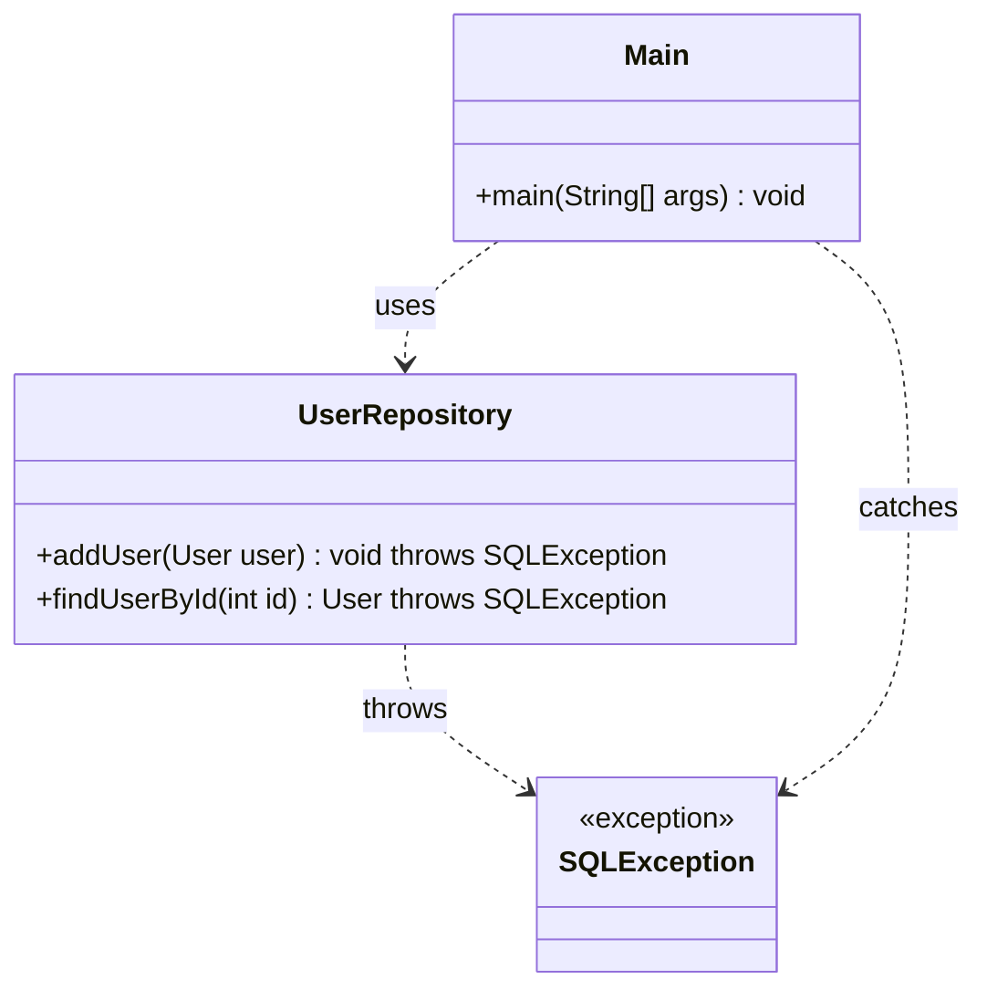
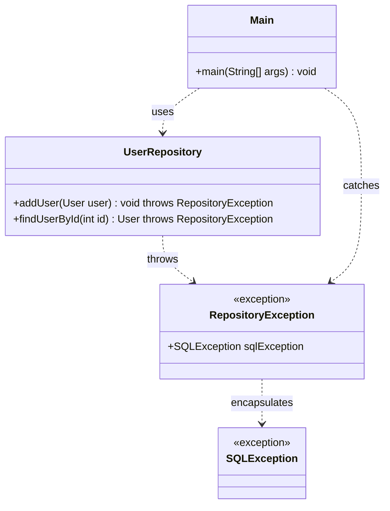

# Exercice 6 - Pattern repository

Une fois les accès à une base de données maîtrisés, on peut 
structurer une application pour implémenter le patron de 
conception Repository et séparer la logique de l’application de 
l’accès à la base de données.

```bash
/src
 ├── dto
 │   ├── User.java
 ├── repository
 │   ├── UserRepository.java
 ├── Main.java

```

La classe main ne doit rien connaître de l'accès aux données.
Les données peuvent provenir d'un fichier, d'une base de données, d'un service rest ou être générées par le code java.


```java title"User.java"
public record User(int id, String name, String email) {
}
```


```java showLineNumbers
package repository;

import model.User;
import java.sql.*;
import java.util.ArrayList;
import java.util.List;

public class UserRepository {
    private final String url = "jdbc:sqlite:database.db"; 

    public UserRepository() {
        
    }

    public void addUser(User user) {
        String sql = "INSERT INTO users (name) VALUES (?)";
        try (Connection conn = DriverManager.getConnection(url);
             PreparedStatement pstmt = conn.prepareStatement(sql, Statement.RETURN_GENERATED_KEYS)) {

            pstmt.setString(1, user.getName());
            pstmt.executeUpdate();

            // Récupérer l'ID généré
            try (ResultSet generatedKeys = pstmt.getGeneratedKeys()) {
                if (generatedKeys.next()) {
                    user.setId(generatedKeys.getInt(1));
                }
            }
        } catch (SQLException e) {
            e.printStackTrace();
        }
    }

    public User getUserById(int id) {
        String sql = "SELECT * FROM users WHERE id = ?";
        try (Connection conn = DriverManager.getConnection(url);
             PreparedStatement pstmt = conn.prepareStatement(sql)) {

            pstmt.setInt(1, id);
            try (ResultSet rs = pstmt.executeQuery()) {
                if (rs.next()) {
                    return new User(rs.getInt("id"), rs.getString("name"));
                }
            }
        } catch (SQLException e) {
            e.printStackTrace();
        }
        return null; // Retourne null si aucun utilisateur trouvé
    }

    public List<User> getAllUsers() {
        List<User> users = new ArrayList<>();
        String sql = "SELECT * FROM users";
        try (Connection conn = DriverManager.getConnection(url);
             Statement stmt = conn.createStatement();
             ResultSet rs = stmt.executeQuery(sql)) {

            while (rs.next()) {
                users.add(new User(rs.getInt("id"), rs.getString("name")));
            }
        } catch (SQLException e) {
            e.printStackTrace();
        }
        return users;
    }

    public void updateUser(User user) {
        String sql = "UPDATE users SET name = ? WHERE id = ?";
        try (Connection conn = DriverManager.getConnection(url);
             PreparedStatement pstmt = conn.prepareStatement(sql)) {

            pstmt.setString(1, user.getName());
            pstmt.setInt(2, user.getId());
            pstmt.executeUpdate();
        } catch (SQLException e) {
            e.printStackTrace();
        }
    }

    public void deleteUser(int id) {
        String sql = "DELETE FROM users WHERE id = ?";
        try (Connection conn = DriverManager.getConnection(url);
             PreparedStatement pstmt = conn.prepareStatement(sql)) {

            pstmt.setInt(1, id);
            pstmt.executeUpdate();
        } catch (SQLException e) {
            e.printStackTrace();
        }
    }
}

```

:::note Exercice A : utilisation du repository

Écrivez un main qui : 
1. Affiche tous les utilisateurs
1. Insère l'utilisateur ...
1. Affiche tous les utilisateurs
1. Met à jour l'utilisateur ...
1. Affiche tous les utilisateurs
1. Supprime l'utilisateur ...
1. Affiche tous les utilisateurs

:::

Dans les imports de la classe `Main` vous observez normalement ...
`Main` dépend de SqlException ce qui brise l'encapsulation.

Diagramme de dépendance




Modifiez le repository pour encapsuler la SQLException.



Pourquoi encapsuler SQLException dans RepositoryException ?

1️⃣ Abstraction des détails d’implémentation

    SQLException est spécifique à JDBC.
    Un Repository doit cacher les détails de la base de données.

2️⃣ Unification des erreurs

    Permet de centraliser et standardiser la gestion des erreurs dans l’application.
    L’appelant n’a pas besoin de gérer directement SQLException (pas de throws SQLException partout).

3️⃣ Éviter les checked exceptions (SQLException est checked)

    RuntimeException permet de ne pas imposer le throws SQLException dans toutes les méthodes.
    Facilite l’utilisation du Repository dans une application plus large (ex: services, API REST).

 Avantages de cette approche

✅ Encapsulation de SQLException

    Évite de propager les erreurs SQL brutes dans les services / contrôleurs.

✅ Code plus propre & maintenable

    RepositoryException remplace SQLException, donc plus besoin de throws SQLException partout.

✅ Gestion centralisée des erreurs

    Possibilité de logger toutes les erreurs JDBC en interceptant RepositoryException au plus haut niveau.    


Si vous avez plusieurs repository, utilisez une interface.

```bash
/src
 ├── dto
 │   ├── User.java
 ├── repository
 │   ├── IRepository.java
 │   ├── UserRepository.java
 ├── Main.java

```

Diagramme de classe.

Vous retrouvez une notation similaire que vous
avez découvert avec spring-data-japa.

Créér la classe ConnexionManager.

```java
import java.io.FileInputStream;
import java.io.IOException;
import java.sql.Connection;
import java.sql.DriverManager;
import java.sql.SQLException;
import java.util.Properties;

class ConnectionManager {

    private static Connection connection;

    static Connection getConnection() {
        if (connection == null) {
            try {
                String url = "jdbc:sqlite:external-data/demo.db";
                connection = DriverManager.getConnection(url);
            } catch (SQLException ex) {
                throw new RepositoryException("Connexion impossible: " + ex.getMessage());
            }
        }
        return connection;
    }

    static void close() {
        try {
            if (connection != null && !connection.isClosed()) {
                connection.close();
            }
        } catch (SQLException e) {
            throw new RepositoryException("Fermeture impossible: " + e.getMessage());
        }
    }
}

```

:::note Exercice B : une connexion unique

Modifiez le repository pour se connecter une seule fois
en utilisant la classe ConnectionManager.

Ajoutez une méthode au Repository close qui appel 
la méthode close de la classe ConnectionManager.

modifiez le main pour fermer la connexion à la fin.

:::


