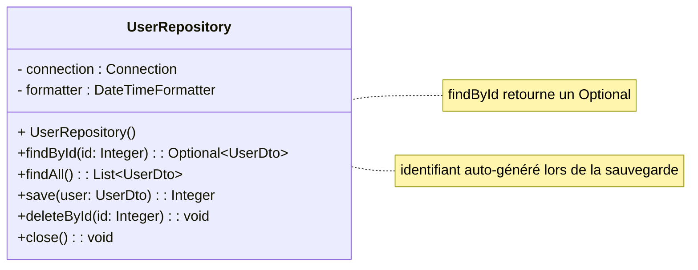
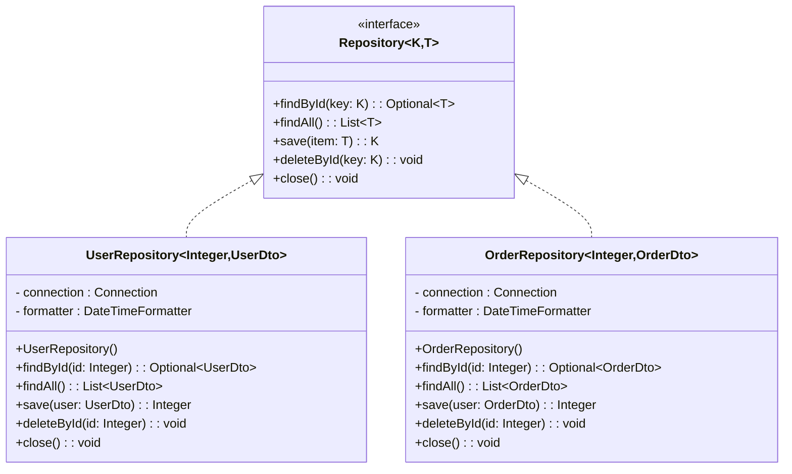

# Exercice 6 - Design pattern repository

Dans cette section vous allez explorer le pattern Repository, 
un modèle qui permet d'organiser et de centraliser l'accès aux données, 
tout en rendant le code plus propre et maintenable. 
Ce pattern est couramment utilisé dans les applications qui interagissent 
avec une base de données.

Avant d'implémenter le **UserRepository**, vous allez explorer plusieurs concepts et étapes essentielles pour mieux structurer votre code :
- Étape 1 : Définition d'un **Data Transfer Object** avec la 
classe `UserDto`.
- Étape 2 : Gestion des exceptions à l'aide d'un **wrapper** 
d'exception avec la classe `RepositoryException`.
- Étape 3 : Mise en place d'une classe de gestion des connexions 
à la base de données : `ConnectionManager`.

Vous allez combiner ces concepts pour créer un UserRepository 
qui utilise les requêtes SQL apprises dans les exercices 
précédents. 

La structure du projet à construire est la suivante : 

```bash
/src/main/java
 ├── dto
 │   ├── UserDto.java
 ├── repository
 │   ├── ConnectionManager.java
 │   ├── RepositoryException.java
 │   ├── UserRepository.java
 ├── RepositorySandbox.java
```

## Data Transfert Object

Un **DTO** (Data Transfer Object) est un objet utilisé pour 
transporter des données entre différentes couches d’une 
application, notamment entre :
- La base de données et la couche métier
- La couche métier et la couche présentation

Depuis Java 14, la syntaxe **record** permet de simplifier 
l’écriture des DTO en rendant les classes immutables et en 
générant automatiquement :
- Les constructeurs.
- Les accesseurs.
- Les méthodes `equals()`, `hashCode()` et `toString()`.

Créez le record `UserDto` représentant une ligne de la table 
Users comme ci-dessous.

```java showLineNumbers title="UserDto.java"
import java.time.LocalDate;

public record UserDto(int id, String name, LocalDate birthDate, double height, boolean active) {}
```

## Encapsuler une SQLException

**SQLException** est l'exception générée par JDBC lorsqu'une 
erreur se produit lors de l'interaction avec la base de données 
(par exemple, une erreur dans une requête SQL, une violation de 
contrainte, un problème de connexion,...).

Dès qu'une classe contient `import java.sql.SQLException`, elle
devient dépendante à l'implémentation de l'accès aux données.
Afin d'éviter que toutes les classes métier dépendent de cette 
SQLException, vous allez créer une **RepositoryException**.
Cette exception personnalisée est une exception enveloppante,
ou **wrapper**, qui permet de gérer toutes les erreurs liées à 
la couche de persistance dans une application sans que les 
détails techniques spécifiques à JDBC ne se propagent au reste 
de l'application.

Créez l'exception enveloppante `RepositoryException` comme ci-dessous.

```java showLineNumbers title="RepositoryException.java"
public class RepositoryException extends RuntimeException {
    public RepositoryException(String message, Throwable cause) {
        super(message, cause);
    }
}
```

:::info exception **non vérifiée**

`RepositoryException` est une classe qui hérite de 
**RuntimeException**, ce qui signifie qu'elle représente une 
exception **non vérifiée** (unchecked exception).
En Java, les exceptions non vérifiées ne nécessitent pas d’être 
déclarées avec throws ni capturées obligatoirement avec un 
try-catch.

Le constructeur permet de créer une `RepositoryException` en 
spécifiant :
- `message` : une description de l'erreur.
- `cause` : l'exception d'origine qui a déclenché cette erreur.

:::

## Gestion de la connexion

Dans le cadre de l'implémentation du design pattern Repository, 
il est généralement préférable de se connecter une seule fois 
lors de l'initialisation de l'objet Repository. 
Cela permet de réutiliser la même connexion pour plusieurs opérations (en particulier si vous effectuez plusieurs actions 
au sein d'une même transaction) et peut améliorer les 
performances en évitant de créer une nouvelle connexion à chaque
appel de méthode.

Créez la classe `ConnectionManager` qui permet de retourner une 
connexion unique à la base de données SQLite.

```java showLineNumbers title="ConnectionManager.java"
import java.sql.Connection;
import java.sql.DriverManager;
import java.sql.SQLException;

class ConnectionManager {
    private static Connection connection;

    static Connection getConnection() {
        if (connection == null) {
            try {
                String url = "jdbc:sqlite:external-data/demo.db";
                connection = DriverManager.getConnection(url);
            } catch (SQLException ex) {
                throw new RepositoryException("Connexion impossible", ex);
            }
        }
        return connection;
    }

    static void close() {
        try {
            if (connection != null && !connection.isClosed()) {
                connection.close();
            }
        } catch (SQLException ex) {
            throw new RepositoryException("Fermeture impossible", ex);
        }
    }
}
```

`ConnectionManager` possède également une méthode pour fermer 
la connexion. Chaque méthode envoie une `RepositoryException`
qui cache la dépendance à `java.sql.SQLException`.

## Première version du repository

L’idée derrière le pattern Repository est d’avoir au sein de 
l’application, une classe qui centralise les accès à un type de 
données.
Par exemple nous allons créer une classe `UserRepository` qui 
va être le point d’accès des données concernant les 
utilisateurs. 
Si nous avions besoin d’accéder aux informations concernant les 
commandes nous créerions une classe `OrdersRepository`.

La classe UserRepository peut être représentée via le diagramme suivant : 



:::tip La classe Optional

En Java, l'utilisation de la classe Optional permet de gérer de 
manière plus élégante les valeurs null et d'éviter les erreurs 
courantes liées aux **NullPointerException**.

Utiliser Optional dans les méthodes de retour permet d'exprimer
l'intention du code plus clairement. Cela montre que le résultat
de l'opération peut ou non être présent. 
Plutôt que de renvoyer un null, qui peut être négligé ou mal 
compris, vous utilisez un Optional pour signaler explicitement 
l'absence de valeur.

:::

L'implémentation de la classe UserRepository ci-dessous reprend 
toutes les requêtes que vous avez utilisées dans les exercices 
précédents.

```java showLineNumbers title="UserRepository.java"
import dto.UserDto;
import java.sql.Connection;
import java.sql.PreparedStatement;
import java.sql.ResultSet;
import java.sql.SQLException;
import java.time.LocalDate;
import java.time.format.DateTimeFormatter;
import java.util.ArrayList;
import java.util.List;
import java.util.Optional;

public class UserRepository {
    private final Connection connection;

    private final DateTimeFormatter formatter;

    public UserRepository() {
        connection = ConnectionManager.getConnection();
        formatter = DateTimeFormatter.ofPattern("yyyy-MM-dd");
    }

    public Optional<UserDto> findById(int id) {
        String sql = """
                SELECT 
                    * 
                FROM 
                    users 
                WHERE 
                    id = ?
                """;
        try (PreparedStatement stmt = connection.prepareStatement(sql)) {
            stmt.setInt(1, id);
            try (ResultSet rs = stmt.executeQuery()) {
                if (rs.next()) {
                    String name = rs.getString("name");
                    String dateText = rs.getString("birth_date");
                    LocalDate birthDate = LocalDate.parse(dateText, formatter);
                    double height = rs.getDouble("height");
                    boolean active = rs.getBoolean("is_active");

                    UserDto user = new UserDto(id, name, birthDate, height, active);

                    return Optional.of(user);
                }
            }
        } catch (SQLException e) {
            throw new RepositoryException("Selection impossible", e);
        }
        return Optional.empty();
    }

    public List<UserDto> findAll() {
        List<UserDto> users = new ArrayList<>();
        String sql = "SELECT * FROM users";
        try (PreparedStatement stmt = connection.prepareStatement(sql);
             ResultSet rs = stmt.executeQuery()) {
            while (rs.next()) {
                int id = rs.getInt("id");
                String name = rs.getString("name");
                String dateText = rs.getString("birth_date");
                LocalDate birthDate = LocalDate.parse(dateText, formatter);
                double height = rs.getDouble("height");
                boolean active = rs.getBoolean("is_active");

                UserDto user = new UserDto(id, name, birthDate, height, active);
                users.add(user);
            }
        } catch (SQLException e) {
            throw new RepositoryException("Selection impossible", e);
        }
        return users;
    }

    public int save(UserDto user) {
        String sql = """
                INSERT INTO 
                    users (name, birth_date, height, is_active) 
                VALUES 
                    (?, ?, ?, ?)
                """;
        try (PreparedStatement stmt = connection.prepareStatement(sql, PreparedStatement.RETURN_GENERATED_KEYS)) {
            stmt.setString(1, user.name());
            String datetext = formatter.format(user.birthDate());
            stmt.setString(2, datetext);
            stmt.setDouble(3, user.height());
            stmt.setBoolean(4, user.active());
            stmt.executeUpdate();

            try (ResultSet rs = stmt.getGeneratedKeys()) {
                if (rs.next()) {
                    return rs.getInt(1); // Retourne l'ID généré
                }
            }

        } catch (SQLException e) {
            throw new RepositoryException("Insertion impossible", e);
        }
        return -1;
    }

    public void delete(int id) {
        String sql = "DELETE FROM users WHERE id = ?";
        try (PreparedStatement stmt = connection.prepareStatement(sql)) {
            stmt.setInt(1, id);
            stmt.executeUpdate();
        } catch (SQLException e) {
            throw new RepositoryException("Suppression impossible", e);
        }
    }

    public void close() {
        ConnectionManager.close();
    }

}
```

Créez la classe `UserRepository` dans votre projet.

:::note Exercice A : Utilisation du repository

Dans une nouvelle classe `RepositorySandbox` créez une
méthode `public static void main(String[] args)` qui en 
utilisant une instance de la classe `UserRepository` : 
1. Affiche tous les utilisateurs de la table Users.
1. Insère l'utilisateur actif Isaac, né le 01/12/1995, mesurant 1.89 mètre.
1. Affiche tous les utilisateurs de la table Users.
1. Met à jour l'utilisateur Isaac en changeant sa taille à 1.74 mètre.
1. Affiche tous les utilisateurs de la table Users.
1. Supprime l'utilisateur Isaac.
1. Affiche tous les utilisateurs de la table Users.
1. Ferme la connexion au repository.

Les imports de la classe `RepositorySandbox` permettent-ils de
déterminer si les données proviennent d'une base de données,
d'un fichier ou d'un service web ?

:::   

## Plusieurs repository

Si vous gérez plusieurs repositories, il est recommandé 
d'utiliser une interface. Par exemple si vous souhaitez
accéder aux données de la table Orders.



Vous retrouvez une interface similaire à celle que vous
avez découvert avec **spring-data-jpa**.


