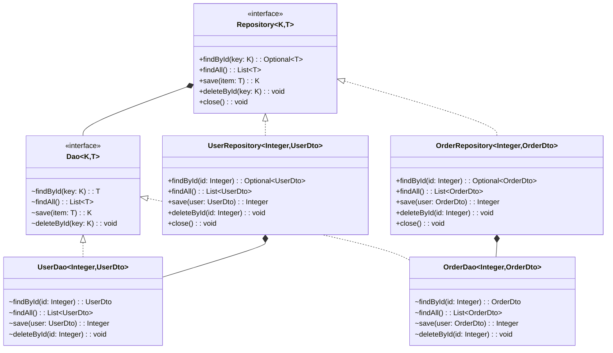

# Exercice 7 - Data Access Object

Dans cet exercice, vous allez partir de l'implémentation 
d'un Repository pour introduire le concept de DAO 
(Data Access Object) et en comprendre l'intérêt dans la 
gestion de l'accès aux données. 

Pour illustrer cette approche, vous utiliserez un Repository 
avec cache, une technique fréquemment utilisée pour améliorer 
les performances des applications en évitant les appels répétitifs 
à la base de données. 
Le cache permet de stocker temporairement les résultats des requêtes 
dans la mémoire, de sorte qu'une fois qu'une donnée est récupérée, 
elle peut être réutilisée sans avoir à interroger à nouveau la base 
de données.

La structure du projet que vous allez construire est
la suivante : 

```bash
/src
 ├── dto
 │   ├── UserDto.java
 ├── repository
 │   ├── ConnectionManager.java
 │   ├── RepositoryException.java
 │   ├── UserDao.java
 │   ├── UserRepository.java
 ├── RepositorySandbox.java
```

## Responsabilité unique

Si vous souhaitez ajouter un système de cache à votre userRepository, 
il est pertinent de le diviser en deux parties distinctes :
- `UserDao` : Responsable de l'accès aux données (Base de données SQLite)
- `UserRepository` : Responsable du cache

Cette décomposition respecte [le principe SOLID](https://fr.wikipedia.org/wiki/SOLID_(informatique)), 
chaque classe a une seule responsabilité, ce qui
améliore la maintenance et l'évolutivité de l'application.

## Data access Object

Commencez par créez la classe `UserDao` qui va contenir le code
d'accès aux données initialement dans la classe `UserRepository`.


```java showLineNumbers title="UserDao.java"
import dto.UserDto;

import java.sql.Connection;
import java.sql.PreparedStatement;
import java.sql.ResultSet;
import java.sql.SQLException;
import java.time.LocalDate;
import java.time.format.DateTimeFormatter;
import java.util.ArrayList;
import java.util.List;
import java.util.Objects;

class UserDao {

    private final DateTimeFormatter formatter;

    private final Connection connection;

    UserDao(Connection connection) {
        this.connection = Objects.requireNonNull(connection, "Connexion requise");
        this.formatter = DateTimeFormatter.ofPattern("yyyy-MM-dd");
    }

    UserDto findById(int id) {
        String sql = """
                SELECT 
                    * 
                FROM 
                    users 
                WHERE 
                    id = ?
                """;
        try (PreparedStatement stmt = connection.prepareStatement(sql)) {
            stmt.setInt(1, id);
            try (ResultSet rs = stmt.executeQuery()) {
                if (rs.next()) {
                    String name = rs.getString("name");
                    String dateText = rs.getString("birth_date");
                    LocalDate birthDate = LocalDate.parse(dateText, formatter);
                    double height = rs.getDouble("height");
                    boolean active = rs.getBoolean("is_active");

                    return new UserDto(id, name, birthDate, height, active);
                }
            }
        } catch (SQLException e) {
            throw new RepositoryException("Selection impossible", e);
        }
        return null;
    }

    List<UserDto> findAll() {
        List<UserDto> users = new ArrayList<>();
        String sql = "SELECT * FROM users";
        try (PreparedStatement stmt = connection.prepareStatement(sql);
             ResultSet rs = stmt.executeQuery()) {
            while (rs.next()) {
                int id = rs.getInt("id");
                String name = rs.getString("name");
                String dateText = rs.getString("birth_date");
                LocalDate birthDate = LocalDate.parse(dateText, formatter);
                double height = rs.getDouble("height");
                boolean active = rs.getBoolean("is_active");

                UserDto user = new UserDto(id, name, birthDate, height, active);
                users.add(user);
            }
        } catch (SQLException e) {
            throw new RepositoryException("Selection impossible", e);
        }
        return users;
    }

    int save(UserDto user) {
        String sql = """
                INSERT INTO 
                    users (name, birth_date, height, is_active) 
                VALUES 
                    (?, ?, ?, ?)
                """;

        try (PreparedStatement stmt = connection.prepareStatement(sql, PreparedStatement.RETURN_GENERATED_KEYS)) {
            stmt.setString(1, user.name());
            String datetext = formatter.format(user.birthDate());
            stmt.setString(2, datetext);
            stmt.setDouble(3, user.height());
            stmt.setBoolean(4, user.active());
            stmt.executeUpdate();

            try (ResultSet rs = stmt.getGeneratedKeys()) {
                if (rs.next()) {
                    return rs.getInt(1); // Retourne l'ID généré
                }
            }

        } catch (SQLException e) {
            throw new RepositoryException("Insertion impossible", e);
        }
        return -1;
    }

    void delete(int id) {
        String sql = "DELETE FROM users WHERE id = ?";
        try (PreparedStatement stmt = connection.prepareStatement(sql)) {
            stmt.setInt(1, id);
            stmt.executeUpdate();
        } catch (SQLException e) {
            throw new RepositoryException("Suppression impossible", e);
        }
    }
}
```

## Repository avec cache

Voici une implémentation d’un ``UserRepository`` qui utilise 
**ConcurrentHashMap** comme système de cache pour stocker 
les utilisateurs en mémoire.

```java showLineNumbers title="UserRepository.java"
import dto.UserDto;

import java.sql.Connection;
import java.util.ArrayList;
import java.util.List;
import java.util.Map;
import java.util.Optional;
import java.util.concurrent.ConcurrentHashMap;

public class UserRepository {
    private final UserDao userDao;
    private final Map<Integer, UserDto> userCache;

    public UserRepository() {
        Connection connection = ConnectionManager.getConnection();
        this.userDao = new UserDao(connection);
        this.userCache = new ConcurrentHashMap<>();
        loadCache();
    }

    private void loadCache() {
        userDao.findAll().forEach(
                user -> userCache.put(user.id(), user));
    }

    public Optional<UserDto> findById(int id) {
        return Optional.ofNullable(
                userCache.computeIfAbsent(id, userDao::findById));
    }

    public List<UserDto> findAll() {
        return new ArrayList<>(userCache.values());
    }

    public int save(UserDto user) {
        int generatedId = userDao.save(user);
        if (generatedId != -1) {
            userCache.put(generatedId,
                    new UserDto(generatedId, user.name(),
                            user.birthDate(), user.height(), user.active()));
        }
        return generatedId;
    }

    public void delete(int id) {
        userDao.delete(id);
        userCache.remove(id);
    }

    public void close() {
        ConnectionManager.close();
    }
}
```

## Plusieurs repository

Si vous avez plusieurs repository et plusieurs dao, utilisez des interfaces.



